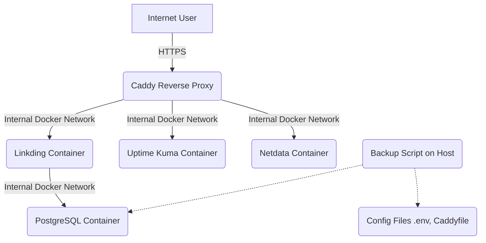

# My Personal VPS Setup (Docker Stack)

[](https://opensource.org/licenses/MIT)
[](https://www.docker.com/)
[](https://docs.docker.com/compose/)
[](https://caddyserver.com/)
[](https://www.postgresql.org/)
[](https://netdata.cloud/)
[](https://uptime.kuma.pet/)

## Overview

This repository holds the configuration files for my personal server running on a VPS. It uses Docker Compose to easily manage several self-hosted web services. Caddy is used as a reverse proxy to provide automatic HTTPS encryption via Let's Encrypt.

The main purpose is for personal use, learning about self-hosting, Linux, Docker, and DevOps practices.

## Features

* **Dockerized:** All services run in Docker containers, managed by Docker Compose.
* **Automatic HTTPS:** Caddy handles SSL/TLS certificates from Let's Encrypt automatically for all defined services.
* **Centralized Secrets:** Uses a `.env` file (ignored by Git) for managing passwords and other secrets.
* **Database Backup:** Includes a basic script (`scripts/backup.sh`) to back up the PostgreSQL database for Linkding and important configuration files.
* **Organized Structure:** Allows for relatively easy addition of new services.

## Services Currently Hosted

* **[Linkding](https://github.com/sissbruecker/linkding):** Self-hosted bookmark manager.
    * Accessible at: `https://bookmarks.mischa.cloud` *(Adjust domain if needed)*
* **[Uptime Kuma](https://github.com/louislam/uptime-kuma):** A fancy self-hosted monitoring tool.
    * Accessible at: `https://status.mischa.cloud` *(Adjust domain if needed)*
* **[Netdata](https://github.com/netdata/netdata):** Real-time performance monitoring, metrics, and visualization.
    * Accessible at: `https://netdata.mischa.cloud` *(Adjust domain if needed, requires login)*

## Architecture (Simplified)



## Prerequisites

To run this setup yourself, you would need:

- A VPS or server running Linux (e.g., Ubuntu 24.04).
- Docker and Docker Compose installed.
- Git installed.
- A domain name.
- DNS A record(s) pointing your domain and all desired subdomains (e.g., `bookmarks.yourdomain.com`, `status.yourdomain.com`, `netdata.yourdomain.com`) to the server's IP address.

## Quick Start

1. **Clone this repository:**
    
    Bash
    
    ```
    git clone [https://github.com/mischa-kaufmann/my-vps.git](https://github.com/mischa-kaufmann/my-vps.git)
    cd my-vps
    ```
    
2. **Create your environment file from the example:**
    
    Bash
    
    ```
    cp .env.example .env
    ```
    
3. **Edit the `.env` file** and set your secure secrets:
    
    Bash
    
    ```
    nano .env
    ```
    
    You will need to set at least:
    
    - `POSTGRES_USER` (e.g., `linkding`)
    - `POSTGRES_PASSWORD` (a strong, unique password for the database)
    - `NETDATA_USERNAME` (your desired username for Netdata access)
    - `NETDATA_PASSWORD_HASH` (generate this hash using the command: `docker compose exec caddy caddy hash-password --plaintext "YourChosenNetdataPassword"`. Remember to quote the resulting hash in the `.env` file, e.g., `'$2a$14$AbCd...'`)
    - _(Optional) Set your `TZ` (Timezone, e.g., `Europe/Zurich`)_
4. **DNS Setup:** Make sure your DNS A records for `bookmarks.yourdomain.cloud`, `status.yourdomain.cloud`, and `netdata.yourdomain.cloud` (or your chosen domains/subdomains) point to your server's public IP address. **Wait for DNS propagation if you just made changes.**
    
5. **Pull the latest Docker images** for the services (optional, `up -d` will also pull if not present):
    
    Bash
    
    ```
    docker compose pull
    ```
    
6. **Start all services** using Docker Compose:
    
    Bash
    
    ```
    docker compose up -d --remove-orphans
    ```
    
    _(The `--remove-orphans` flag removes containers for services no longer defined in the `docker-compose.yml` file, if any. The `-d` flag starts containers in detached mode.)_
    
7. Wait a few minutes for the services to start and for Caddy to provision HTTPS certificates (you can monitor Caddy logs with `docker compose logs -f caddy`).
    
8. **Access your services:**
    
    - Linkding: `https://bookmarks.mischa.cloud`
    - Uptime Kuma: `https://status.mischa.cloud`
    - Netdata: `https://netdata.mischa.cloud` (will prompt for the username and password you configured via the `.env` file)

## Usage

- **Accessing Services:** Use the HTTPS URLs listed above.
- **Backups:** Run `bash scripts/backup.sh` to create a database dump for Linkding and copies of `.env` and `Caddyfile` in the `backups/` directory. Schedule this with `cron` for automatic backups. **Note:** This script does _not_ currently back up Uptime Kuma or Netdata application data volumes.
- **Stopping Services:** `docker compose down`
- **Starting Services:** `docker compose up -d`
- **Viewing Logs:** `docker compose logs <service_name>` (e.g., `docker compose logs caddy`)
- **Updating Application Images:** Periodically, you can pull the latest images defined in `docker-compose.yml` with `docker compose pull` and then restart the services with `docker compose up -d --force-recreate <service_name_if_specific_or_all>`.

## Configuration

- **`.env`:** Contains all secrets (database passwords, Netdata credentials, API keys, timezone, etc.). **Never commit this file to Git!** This file must be created on the server from `.env.example`.
- **`.env.example`:** A template showing which environment variables are needed. Safe to commit to Git.
- **`docker-compose.yml`:** Defines the services (containers), networks, volumes, and environment variable passthrough.
- **`caddy/Caddyfile`:** Caddy web server configuration. Defines sites, domain names, reverse proxy rules, and authentication.
- **`scripts/backup.sh`:** Helper script for backups.

## Contributing

Feel free to open an issue if you find a bug or have a suggestion. Pull requests are welcome, but please open an issue first to discuss major changes.

## License

This project is licensed under the MIT License.