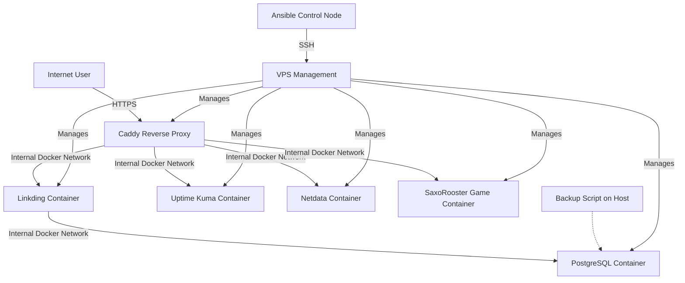

# My VPS

[](https://opensource.org/licenses/MIT)
[](https://www.ansible.com/)
[](https://www.docker.com/)
[](https://docs.docker.com/compose/)
[](https://caddyserver.com/)
[](https://www.postgresql.org/)
[](https://netdata.cloud/)
[](https://uptime.kuma.pet/)
[](https://saxorooster.mischa.cloud)

## Overview

This repository holds the configuration files (`docker-compose.yml`, `Caddyfile`, etc.) and an **Ansible playbook** for my personal server setup running on a VPS. It utilizes Docker Compose to easily manage several self-hosted web services, all fronted by Caddy as a reverse proxy for automatic HTTPS.

The primary purpose of this setup is for personal use, learning about self-hosting, Linux, Docker, DevOps practices (including Infrastructure as Code with Ansible), and running useful applications.

## Features

* **Fully Dockerized:** All services run in isolated Docker containers.
* **Automated Deployment with Ansible:** The entire stack, including dependencies and Docker services, can be deployed and configured using the provided Ansible playbook.
* **Automatic HTTPS:** Caddy handles SSL/TLS certificate provisioning and renewal automatically.
* **Centralized Secrets Management with Ansible Vault:** Sensitive credentials (passwords, API keys) are managed using Ansible Vault for secure storage within the repository. The Ansible playbook then generates the necessary `.env` file on the server. For manual setups, a traditional `.env` file (created from `.env.example`) is used.
* **Database Backup Script:** Includes a script (`scripts/backup.sh`) for PostgreSQL database backups (used by Linkding).
* **Organized & Extendable Structure:** Designed for relatively straightforward addition of new services.

## Services Currently Hosted


* ***[Linkding](https://github.com/sissbruecker/linkding):** A self-hosted bookmark manager.
    * Accessible at: `https://bookmarks.mischa.cloud`
* **[Uptime Kuma](https://github.com/louislam/uptime-kuma):** A user-friendly, self-hosted monitoring tool.
    * Accessible at: `https://status.mischa.cloud`
* **[Netdata](https://github.com/netdata/netdata):** Real-time performance monitoring, metrics, and visualization for the VPS.
    * Accessible at: `https://netdata.mischa.cloud` (Requires login)
* **[SaxoRooster Game](https://hub.docker.com/r/mischakaufmann/saxorooster-game):** My fun Scratch game, dockerized and served with Caddy!
    * Accessible at: `https://saxorooster.mischa.cloud`

## Architecture (Simplified)



## Automated Deployment with Ansible

This is the recommended method for deploying the stack.

### Prerequisites for Ansible Deployment

- **Ansible:** Installed on your control machine (the machine you run Ansible commands from).
- **SSH Access:** SSH access to the target VPS with an authorized key for the `ansible_user` defined in the inventory.
- **Git:** Git installed on your control machine to clone this repository.

### Setup and Execution

1. **Clone this repository to your control machine:**
    
    Bash
    
    ```
    git clone [https://github.com/mischakaufmann/my-vps.git](https://github.com/mischakaufmann/my-vps.git) # Replace with your fork if necessary
    cd my-vps
    ```
    
2. **Configure Ansible Inventory:** Edit `ansible/inventory.ini` to match your target VPS IP/hostname and SSH user:
    
    Ini, TOML
    
    ```
    [vps_servers]
    my-vps ansible_host=YOUR_VPS_IP ansible_user=your_ssh_user ansible_ssh_private_key_file=~/.ssh/your_private_key
    ```
    
3. **Prepare Secrets:** The playbook uses Ansible Vault to manage sensitive data. The encrypted secrets file is `ansible/vars/secrets.yml`.
    
    - If you are setting this up for the first time using this repository as a template, you'll need to create your own `secrets.yml`:
        
        Bash
        
        ```
        cd ansible
        ansible-vault create vars/secrets.yml
        ```
        
        You will be prompted for a vault password. Then, add your secrets (refer to `ansible/templates/.env.j2.example` for required variables like `vps_postgres_password`, `vps_netdata_password_hash` etc.).
    - If you have an existing `secrets.yml` and need to edit it:
        
        Bash
        
        ```
        cd ansible
        ansible-vault edit vars/secrets.yml
        ```
        
4. **Run the Ansible Playbook:** From the `ansible` directory (`my-vps/ansible/`):
    
    Bash
    
    ```
    ansible-playbook -i inventory.ini playbook.yml --ask-vault-pass
    ```
    
    Enter your vault password when prompted. The playbook will configure the server, install dependencies, clone the repository to `/srv/my-vps` on the target, generate the `.env` file from the template and your vaulted secrets, and start the Docker Compose stack.
    

## Manual Setup Instructions

If you prefer to set up the stack manually without Ansible:

### Prerequisites for Manual Setup

- A Virtual Private Server (VPS) running a compatible Linux distribution (e.g., Ubuntu 24.04).
- Docker and Docker Compose (V2 syntax: `docker compose`) installed on the server.
- Git installed on the server.
- A domain name that you own, with DNS A record(s) pointing to your server's public IP.

### Steps

1. **Clone this repository onto your VPS:**
    
    Bash
    
    ```
    git clone [https://github.com/mischakaufmann/my-vps.git](https://github.com/mischakaufmann/my-vps.git) # Or your fork
    cd my-vps
    ```
    
2. **Create your environment file:** Copy the example environment file:
    
    Bash
    
    ```
    cp .env.example .env 
    ```
    
    **(Note: Ensure you have a `.env.example` file at the root of your project for this manual step. It should list variables like `POSTGRES_USER`, `POSTGRES_PASSWORD`, `NETDATA_USERNAME`, `NETDATA_PASSWORD_HASH`, `TZ` with placeholder or example values.)**
    
3. **Edit the `.env` file** with your specific secrets and configurations.
    
4. **Customize `caddy/Caddyfile`:** (If using a different domain) Replace instances of `mischa.cloud` with your domain.
    
5. **DNS Setup:** (Ensure DNS records point to your server's IP).
    
6. **Pull Docker images and start services:**
    
    Bash
    
    ```
    docker compose pull
    docker compose up -d --remove-orphans
    ```
    
7. **Initial Setup & Access:** (As described in the original README).
    

## Usage

(This section can largely remain unchanged, but Ansible can also be used for re-running the playbook to update the git repo or re-apply configurations)

- **Accessing Services:** Use the HTTPS URLs.
- **Backups:** Use `bash scripts/backup.sh`.
- **Stopping/Starting Services (Manual):** `docker compose down`, `docker compose up -d`.
- **Viewing Logs (Manual):** `docker compose logs <service_name>`.
- **Updating (Ansible):** Re-running the Ansible playbook can update the cloned repository and restart services if configurations change.
- **Updating (Manual):** (As described in the original README).

## Configuration Files Overview

- **`docker-compose.yml`:** Defines all services, networks, and volumes.
- **`caddy/Caddyfile`:** Main configuration for the Caddy reverse proxy.
- **`.env.example`:** (Located at project root) Template for manual `.env` file creation. Lists required environment variables.
- **`.env`:** (On the server, **not in Git**) Stores actual secrets and configurations. Generated by Ansible or manually from `.env.example`.
- **`scripts/backup.sh`:** Helper script for PostgreSQL backups.
- **`ansible/playbook.yml`:** The main Ansible playbook for automated deployment.
- **`ansible/inventory.ini`:** Ansible inventory file to define target hosts.
- **`ansible/templates/.env.j2.example`:** Jinja2 template used by Ansible to generate the `.env` file on the server.
- **`ansible/vars/secrets.yml`:** Ansible Vault encrypted file storing sensitive variables.

## License

This project configuration is licensed under the MIT License.
