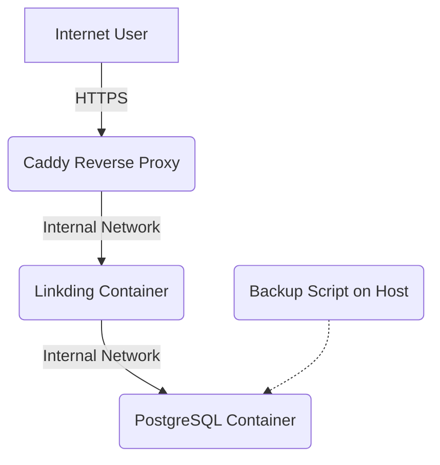

# My Personal VPS Setup (Docker Stack)

[](https://opensource.org/licenses/MIT)
[](https://www.docker.com/)
[](https://docs.docker.com/compose/)
[](https://caddyserver.com/)
[](https://www.postgresql.org/)
## Overview

This repository holds the configuration files for my personal server running on a VPS. It uses Docker Compose to easily manage several self-hosted web services. Caddy is used as a reverse proxy to provide automatic HTTPS encryption via Let's Encrypt.

The main purpose is for personal use, learning about self-hosting, Linux, Docker, and DevOps practices.

## Features

* **Dockerized:** All services run in Docker containers, managed by Docker Compose.
* **Automatic HTTPS:** Caddy handles SSL/TLS certificates from Let's Encrypt automatically.
* **Easy Deployment:** Simple scripts to install and manage the services.
* **Centralized Secrets:** Uses a `.env` file (ignored by Git) for managing passwords and other secrets.
* **Database Backup:** Includes a basic script to back up the PostgreSQL database.
* **Organized:** Structure allows for easy addition of new services.

## Services Currently Hosted

* **[Linkding](https://github.com/sissbruecker/linkding):** Self-hosted bookmark manager.
    * Accessible at: `https://bookmarks.mischa.cloud` (*<- Adjust domain if needed*)

*(More services like Heimdall dashboard, Vaultwarden password manager, etc. might be added later)*

## Architecture (Simplified)



## Prerequisites

To run this setup yourself, you would need:

- A VPS or server running Linux (e.g., Ubuntu 24.04).
- Docker and Docker Compose installed.
- Git installed.
- A domain name.
- DNS A record(s) pointing your domain/subdomains to the server's IP address.

## Quick Start

1. Clone this repository:
    
    Bash
    
    ```
    git clone [https://github.com/mischa-kaufmann/my-vps.git](https://github.com/mischa-kaufmann/my-vps.git)
    cd my-vps
    ```
    
2. Create your environment file from the example:
    
    Bash
    
    ```
    cp .env.example .env
    ```
    
3. **Edit the `.env` file** and set your secure secrets (especially `POSTGRES_PASSWORD`!):
    
    Bash
    
    ```
    nano .env
    ```
    
4. Make sure your DNS A record for `bookmarks.mischa.cloud` (or your chosen domain) points to your server's IP address.
5. Run the installation script:
    
    Bash
    
    ```
    bash scripts/install.sh
    ```
    
6. Wait a few minutes for the services to start and for Caddy to get the HTTPS certificate.
7. Access Linkding at `https://bookmarks.mischa.cloud` (or your chosen domain).

## Usage

- **Accessing Services:** Use the HTTPS URLs configured in the `Caddyfile`.
- **Backups:** Run `bash scripts/backup.sh` to create a database dump in the `backups/` directory (this directory is ignored by Git). Schedule this with `cron` for automatic backups.
- **Stopping Services:** `docker compose down`
- **Starting Services:** `docker compose up -d` (or use `install.sh`)
- **Updating Application Images:** Manually pull new images (`docker compose pull service_name`) and restart the service (`docker compose up -d service_name`). _Note: Watchtower can be added later for automatic updates._

## Configuration

- **`.env`:** Contains all secrets (database passwords, API keys, etc.). **Never commit this file to Git!**
- **`.env.example`:** A template showing which environment variables are needed. Safe to commit.
- **`docker-compose.yml`:** Defines the services (containers), networks, and volumes.
- **`caddy/Caddyfile`:** Caddy web server configuration. Defines sites, domain names, and reverse proxy rules. Add new blocks here when adding new services.
- **`scripts/`:** Contains helper scripts for installation and backups.

## Contributing

Feel free to open an issue if you find a bug or have a suggestion. Pull requests are welcome, but please open an issue first to discuss major changes.

## License

This project is licensed under the MIT License - see the [https://www.google.com/search?q=LICENSE](https://www.google.com/search?q=LICENSE) file for details.
    
    
