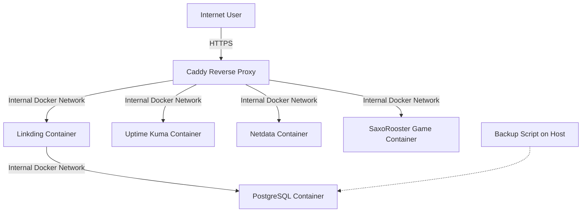

# My VPS 

[](https://opensource.org/licenses/MIT)
[](https://www.docker.com/)
[](https://docs.docker.com/compose/)
[](https://caddyserver.com/)
[](https://www.postgresql.org/)
[](https://netdata.cloud/)
[](https://uptime.kuma.pet/)
[](https://saxorooster.mischa.cloud)

## Overview

This repository holds the configuration files (`docker-compose.yml`, `Caddyfile`, etc.) for my personal server setup running on a VPS. It utilizes Docker Compose to easily manage several self-hosted web services. Caddy is employed as a reverse proxy to provide automatic HTTPS encryption via Let's Encrypt for all exposed services.

The primary purpose of this setup is for personal use, learning about self-hosting, Linux, Docker, DevOps practices, and running useful applications.

## Features

* **Fully Dockerized:** All services run in isolated Docker containers, managed efficiently by Docker Compose.
* **Automatic HTTPS:** Caddy handles SSL/TLS certificate provisioning and renewal from Let's Encrypt automatically for all defined public services.
* **Centralized Secrets Management:** Utilizes a `.env` file (which is git-ignored) for managing passwords, API keys, and other sensitive credentials.
* **Database Backup:** Includes a script (`scripts/backup.sh`) to perform backups of the PostgreSQL database used by Linkding.
* **Organized & Extendable Structure:** Designed to allow for relatively straightforward addition of new services.

## Services Currently Hosted

This setup currently hosts the following services, all accessible via HTTPS:

 *  ***[Linkding](https://github.com/sissbruecker/linkding):** A self-hosted bookmark manager.
    * Accessible at: `https://bookmarks.mischa.cloud`
* **[Uptime Kuma](https://github.com/louislam/uptime-kuma):** A user-friendly, self-hosted monitoring tool.
    * Accessible at: `https://status.mischa.cloud`
* **[Netdata](https://github.com/netdata/netdata):** Real-time performance monitoring, metrics, and visualization for the VPS.
    * Accessible at: `https://netdata.mischa.cloud` (Requires login as configured in the Caddyfile and `.env`)
* **[SaxoRooster Game](https://hub.docker.com/r/mischakaufmann/saxorooster-game):** My fun Scratch game, dockerized and served with Caddy! (CS50x & DevOps with Docker course project).
    * Accessible at: `https://saxorooster.mischa.cloud`

## Architecture (Simplified)



## Prerequisites

To replicate or adapt this setup, you would generally need:

- A Virtual Private Server (VPS) or any server running a compatible Linux distribution (e.g., Ubuntu 24.04).
- Docker and Docker Compose (V2 syntax: `docker compose`) installed on the server.
- Git installed (for cloning this repository).
- A domain name that you own.
- DNS A record(s) pointing your domain and all desired subdomains (e.g., `your.domain`, `bookmarks.your.domain`, `status.your.domain`, `netdata.your.domain`, `saxorooster.your.domain`) to your server's public IP address.

## Quick Start / Setup Instructions

These instructions describe setting up this stack on a fresh server. **Adapt domain names and paths as needed if you are using this as a template for your own setup.**

1. **Clone this repository (or your fork):**
    
    Bash
    
    ```
    git clone [https://github.com/mischakaufmann/my-vps.git](https://github.com/mischakaufmann/my-vps.git)
    cd my-vps
    ```
    
2. **Create your environment file from the example:**
    
    Bash
    
    ```
    cp .env.example .env
    ```
    
3. **Edit the `.env` file** with your specific secrets and configurations:
    
    Bash
    
    ```
    nano .env
    ```
    
    You will need to set at least:
    
    - `POSTGRES_USER` (e.g., `linkdinguser`)
    - `POSTGRES_PASSWORD` (a strong, unique password)
    - `NETDATA_USERNAME` (your desired username for Netdata web access)
    - `NETDATA_PASSWORD_HASH` (generate this hash using the command: `docker compose exec caddy caddy hash-password --plaintext "YourChosenNetdataPassword"`. Remember to quote the resulting hash in the `.env` file, e.g., `'$2a$14$AbCd...'`)
    - _(Optional) Set your `TZ` (Timezone, e.g., `Europe/Zurich`)_
4. **Customize `caddy/Caddyfile`:**
    
    - If you are using your own domain, open `caddy/Caddyfile` and replace all instances of `mischa.cloud` with your own domain name. For example, change `bookmarks.mischa.cloud` to `bookmarks.your.domain`.
5. **DNS Setup:**
    
    - Ensure your DNS A records for all the domains/subdomains defined in your `Caddyfile` (e.g., `bookmarks.your.domain`, `status.your.domain`, `netdata.your.domain`, `saxorooster.your.domain`) point to your server's public IP address.
    - **Wait for DNS propagation** if you just made changes (this can take a few minutes to a few hours).
6. **Pull the latest Docker images** for the services (optional, `up -d` will also pull if not present):
    
    Bash
    
    ```
    docker compose pull
    ```
    
7. **Start all services** using Docker Compose:
    
    Bash
    
    ```
    docker compose up -d --remove-orphans
    ```
    
    - The `-d` flag starts containers in detached mode.
    - `--remove-orphans` removes containers for services no longer defined in the `docker-compose.yml` file, if any.
8. **Initial Setup & Access:**
    
    - Wait a few minutes for the services to initialize and for Caddy to provision HTTPS certificates (you can monitor Caddy logs with `docker compose logs -f caddy`).
    - Access your services via their HTTPS URLs (e.g., `https://bookmarks.mischa.cloud`, `https://status.mischa.cloud`, `https://netdata.mischa.cloud`, `https://saxorooster.mischa.cloud`). For Netdata, you will be prompted for the username and password you configured.

## Usage

- **Accessing Services:** Use the HTTPS URLs you configured in your `Caddyfile` and DNS.
- **Backups:**
    - The script `scripts/backup.sh` creates a PostgreSQL database dump for the `linkding` service.
    - Run it with: `bash scripts/backup.sh`
    - It's recommended to schedule this script (e.g., using `cron`) for automatic regular backups.
    - **Note:** This script currently only backs up the Linkding database. Data for Uptime Kuma, Netdata, and SaxoRooster (which is stateless in the container) are managed via their respective Docker volumes or are served statically. Persisted data for these other services (like Uptime Kuma's data) are stored in Docker volumes (`uptime-kuma-data`, `netdatalib`, etc.) and would require a separate volume backup strategy if full data backup for those is needed.
- **Stopping Services:** `docker compose down`
- **Starting Services:** `docker compose up -d`
- **Viewing Logs:** `docker compose logs <service_name>` (e.g., `docker compose logs caddy`, `docker compose logs linkding`)
- **Updating Application Images:** Periodically, you can update the service images to their latest versions (as defined by the tags in `docker-compose.yml`):
    1. `docker compose pull` (fetches newer versions of images for all services)
    2. `docker compose up -d --force-recreate --remove-orphans` (recreates containers using the new images)

## Configuration Files Overview

- **`.env`:** Stores all secrets (database passwords, Netdata credentials, API keys, timezone, etc.). **This file MUST NOT be committed to Git!** It should be created on the server from `.env.example`.
- **`.env.example`:** A template demonstrating the required environment variables. Safe to commit to Git.
- **`docker-compose.yml`:** Defines all services (containers), their configurations, networks, volumes, and how environment variables are passed from the `.env` file.
- **`caddy/Caddyfile`:** The main configuration file for the Caddy reverse proxy. It defines sites, domain names, reverse proxy rules to backend services, and can include authentication mechanisms.
- **`scripts/backup.sh`:** A helper script for backing up the Linkding PostgreSQL database.

## License

This project configuration is licensed under the MIT License.
